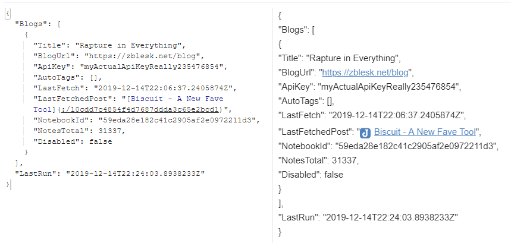

# Ghoplin
A tool for downloading posts from [Ghost](https://ghost.org/) blogs into the [Joplin](https://joplinapp.org/) note-taking app.

## Why? 

Joplin keeps my notes. Many of my blog posts are just neater summaries of my notes or the things I've learned. When I search Joplin, I want all of my blog posts to be included in the search as well. **The downloaded notes contain original post URLs, tags and the Created and Modified timestamps are set to the date of post publication**.  

## How? 

First tell Ghoplin about all the Ghost blogs you want to sync; then run sync. Let Ghoplin download all posts. 

Since I like my E2EE and don't want an unencrypted version of my notes leaving my devices, the app has to run locally. Therefore it's a simple terminal app you have to run locally. 

Tested on Windows and Linux (Ubuntu on WSL, to be precise). Since it's written in .NET Core 3.1, it should run wherever _it_ runs, though. 


## Usage - quickstart

Download the appropriate file from the Releases page. The commands below are same regardless of platform, the only difference is that e.g. in Powershell on Windows the invocation will look like `.\Ghoplin.exe <command>`, whereas in Fish on Ubuntu it'll be `./Ghoplin <command>`. 

To get help for any command, try something like `Ghoplin help`, `Ghoplin add help` etc.

### 1. Specify Joplin API token

First you have to let Ghoplin talk to your Joplin, which has to be running when Ghoplin runs.  

> If you don't have the token yet: In Joplin, go to Tools -> Options -> Web Clipper. Enable it, if it isn't enabled yet. Then copy the *Authorisation token* in the Advanced options section.

**You can either input your token** (and port, if non-default) **every time you run Ghoplin by passing it in a parameter**, i.e. appending `-t thisIsMyToken546168135413243` to each command. 

**Or you can save your token into a config file that will be placed next to the executable.** The easiest way to write this file is by running:

```
Ghoplin write-config -t thisIsMyToken546168135413243
```

Then you no longer need to specify the token when running subsequent commands.

### 2. Add your blogs

For each blog you want to add, run `add`: 

```
Ghoplin add --url https://zblesk.net/blog --apiKey myActualApiKeyReally235476854 --notebook "English blog"
```

So you need to specify the URL of your blog, your API key and the Joplin's notebook. **You can either specify Joplin's internal notebook ID, or just specify it by  name - make sure it's the only notebook with that name, though.**

If you want to **apply tags to each note from this blog, use the `--auto-tags` argument.** Feed it a comma-separated list of tags. 

I.e. to tag all posts with the tag "blog" and "fun stuff", write:

```
--auto-tags "blog,fun stuff"
```

> If you don't have your blog's API key yet,  it's in Ghost's admin console -> Integrations -> Custom integrations. Create a new one,  then copy the  *Content API Key*.  (The Integrations screen is probably at `yourBlogUrl/ghost/#/settings/integrations`.)


### 3. Run Sync

Then just run:

```
Ghoplin sync
```

This downloads all the posts from the blog in chronological order. 

When you later want to add newer posts, just re-run `Ghoplin sync`. It remembers the time of last sync for each blog and will only download new posts. 


## Where is the config located?

It's stored in Joplin, so you don't have to track it manually in order to run Ghoplin on multiple computers. 

When you first set Ghoplin up, it **creates a note** called `Ghoplin config` in the default location. (Joplin will probably create it in the last notebook you've used.) 

⚠ **After the config note is created, you can rename it or move it  wherever you wish.**

### What's in the config?

JSON. 

After the add and sync as described above, it would look something like this:



The link to the last created post is clickable and leads to the note in Joplin.

If you change the value of `Disabled` to `true`, that blog will not be synced anymore.


## Building from source

If you've never used .NET Core before: 

0. Prerequisite: .NET Core 3.1 SDK. [Download here for Windows, Mac, Linux.](https://dotnet.microsoft.com/download)
1. Download/clone source code.
2. `cd Ghoplin`
3. `dotnet run`

If you have used it before then yes, it's just download and `dotnet run`. That will also restore any NuGet packages needed.


## Other considerations

**Does Ghoplin collect and send any of my data, be it note contents or API keys?**

No. 

**Does it do bidirectional sync?**

No. 

**Update notes already synced once?** 

No.

**License?**

[MIT](https://github.com/zblesk/Ghoplin/blob/master/LICENSE).